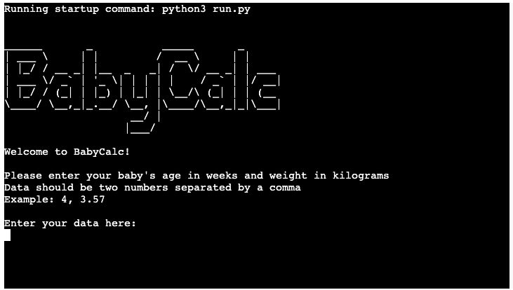

# BabyCalc
BabyCalc is a Python script that helps parents track their baby's age and weight, and calculates the amount of formula the baby needs per day.

## Contents

* [User Experience](#user-experience-ux)
  * [User Stories](#user-stories)

* [Features](#features)

* [Technologies Used](#technologies-used)
  * [Languages Used](#languages-used)
  * [Frameworks, Libraries & Programs Used](#frameworks-libraries--programs-used)

* [Deployment & Local Development](#deployment--local-development)
  * [Deployment](#deployment)
    * [How to Fork](#how-to-fork)
    * [How to Clone](#how-to-clone)
    * [APIs](#apis)

* [Testing](#testing)

* [Credits](#credits)
  * [Code Used](#code-used)
  * [Acknowledgements](#acknowledgements)

  ---

  ## User Experience (UX)

  ### Project Goals

    This backend application aims to make it simple and straightforward for new parents to keep track of their baby's age, weight, and how much formula they should be feeding them per day.

    Info entered by users is added to a google spreadsheet and when new values are added, the application will return the change from the previous values.

## User Stories

### Client Goals

As a user, I want to:

- Enter my baby's age in weeks and weight in kilograms
- Have the input data validated to ensure it's in the correct format
- See the calculated amount of formula my baby needs per day
- See the change in my baby's age and weight since the previous entry
- Run the program multiple times to track my baby's progress

---

## Features

- Prompts the user to enter their baby's age in weeks and weight in kilograms
- Validates the input data to ensure it's in the correct format
- Calculates the amount of formula the baby needs per day based on their age and weight
- Updates a Google Spreadsheet with the baby's data and calculates the change in age and weight since the previous entry
- Allows the user to run the program multiple times

#### Feedback For Invalid Inputs

- Every input by the user is checked to make sure it is valid (only two numerical values separated by a comma).
- Entry of anything else will return an error and inform the user of what is required.

---

  ## Data Storage (Google Sheets)

The data for the application regarding appointments is stored in a google sheet. You can view the sheet [here.](https://docs.google.com/spreadsheets/d/1rFyPWVbUvtZw8KKPK50SfA07DxpsVxPPcBVUddJuZHY/edit?usp=sharing)

  ## Technologies Used

  ### Languages Used

  Python was used to create this application.

  ### Frameworks, Libraries & Programs Used

  Git - For version control.

  Github - To save and store the files for the application.

  GitPod - To develop project and organise version control.

  Heroku - To deploy the application.

  ---

## Deployment & Local Development

### Deployment

The deployment of the project was done using [Heroku](https://www.heroku.com/) through the following steps.

1. Log in to Heroku or create an account if necessary.
2. Click on the button labeled "New" from the dashboard in the top right corner and select the "Create new app" option in the drop-down menu.
3. Enter a unique name for the application and select the region you are in.
   * For this project, the unique name is "BabyCalc" and the region selected is Europe.
4. Click on "create app".
5. Navigate to the settings tab and locate the "Config Vars" section and click "Reveal config vars".
6. Add a config var (if the project uses creds.json file.)
   * In the "KEY" field:
      * enter "CREDS" in capital letters.
   * In the "VALUE" field:
      * copy and paste the contents of your creds.json file and click "Add".
7. Add another config var.
   * In the "KEY" field:
      * enter PORT in all capital letters.
   * In the "VALUE" field:
      * enter 8000 and click "Add".
8. Scroll to the "Buildpacks" section and click "Add buildpack".
9. Select Python and save changes.
10. Add another buildpack and select Nodejs then save changes again.
11. Ensure that the python buildpack is above the Nodejs buildpack.
12. Navigate to the "Deploy" section by clicking the "Deploy" tab in the top navbar.
13. Select "GitHub" as the deployment method and click "Connect to GitHub".
14. Search for the GitHub repository name in the search bar.
15. Click on "connect" to link the repository to Heroku.
16. Scroll down and click on "Deploy Branch".
17. Once the app is deployed, Heroku will notify you and provide a button to view the app.

NB - If you wish to rebuild the deployed app automatically every time you push to GitHub, you may click on "Enable Automatic Deploys".

### How to Fork

This can be done to create a copy of the repository. The copy can be viewed and edited without affecting the original repository.

To fork the repository through GitHub, take the following steps:
1. In the "BabyCalc" repository, click on the "fork" tab in the top right corner.
2. Click on "create fork" to fork the repository.

### How to Clone

To clone the repository through GitHub:

1. In the repository, select the "code" tab located just above the list of files and next to the gitpod button.
2. Ensure HTTPS is selected in the dropdown menu.
3. Copy the URL under HTTPS.
4. Open Git Bash in your IDE of choice.
5. Change the current working directory to the location where you want the cloned directory to be created.
6. Type "git clone" and paste the URL that was copied from the repository.
7. Press the "enter" key to create the clone.

### APIs
In order for the app to function properly, APIs need to be set up and connected. In particular, the following APIs were used for this project:

* Google Drive API.
   * This helps with getting credentials to access the files within google drive.
* Google Sheets API.
   * This is the API for the google sheets where the data is stored for the program.

---

## Testing

Testing was ongoing throughout the build.

### Python PEP8 Testing

I used the Code Institute Python Linter to check for syntax and styling errors and found none.

### Solved Bugs

1. After the user input their values, the returned text was unevenly spaced in the terminal on Heroku despite looking okay in the gitpod terminal. This was eventually fixed by using triple double quotes to wrap the inside of the f string literals on those lines.

### Known Bugs

1. No known bugs at this time.

### Full Testing

I fully tested the application by inputting a number of incorrect values to make sure the application returned the appropriate error.

Instead of a number I input a letter and received the error "Invalid data: could not convert string to float: 'w', please try again."

I input only one number and received the error "Invalid data: Exactly 2 values required, you provided 1, please try again."

I input more than two numbers and received the error "Invalid data: Exactly 2 values required, you provided 3, please try again."

I input two numbers with a space instead of a comma and received the error "Invalid data: could not convert string to float: '4 5', please try again."

---

## Credits

### Code Used

Some functions adapted from Love Sandwiches tutorial.

### Acknowledgements

Dedicated to my daughter Lita who inspired the project and was born during project planning!